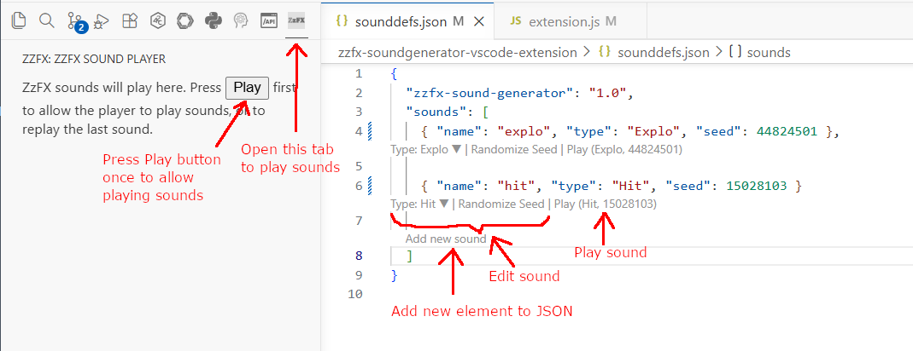

# ZzFX sound generator VS Code extension

This extension is based on [ZzFX](https://killedbyapixel.github.io/ZzFX/), which is a small Javascript tool + library that makes it easy to procedurally generate game sounds, in the style of SFXR, JFXR, BFXR, etc.

This extension plays ZzFX generated sounds specified in a JSON file, via codelenses.  You can quickly define the sounds by specifying sound type and random seed in a JSON file, which can then be loaded into your game. An example sound player is included in the GIT repository (exampleplayer.html).  This player loads the JSON definitions, then creates buttons for playing the sounds.

The sound is played via a webview in the action bar.  Select the ZzFX tab in the action bar, then press the Play button once to enable sounds (this is a Chrome security feature).  Then you can use the codelenses to edit and play sounds.




The JSON sounds specification should look like this:

```
{
  "zzfx-sound-generator": "1.0",   // <-- this line indicates that this is a sound generator definition file
  // you can define a number of sounds by specifying name, type, and seed. Type and seed are used to create a random sound.
  "sounds": [ 
	{ "name": "explo", "type": "Explo", "seed": 12345 },

	{ "name": "hit", "type": "Hit", "seed": 12345 }
	
  ]
}
```

## How to re-build from source

Download/clone the repo (https://github.com/borisvanschooten/zzfx-soundgenerator-vscode-extension). Make sure to install the **vsce** tool:

```
npm install -g @vscode/vsce
```

Go to the repo's root directory, then:

```
vsce package (or npm run package)
```

This will create a vsix package, which you can install in VSCode:
- go to the extensions: marketplace tab
- in the triple dot menu, select "install from VSIX"
